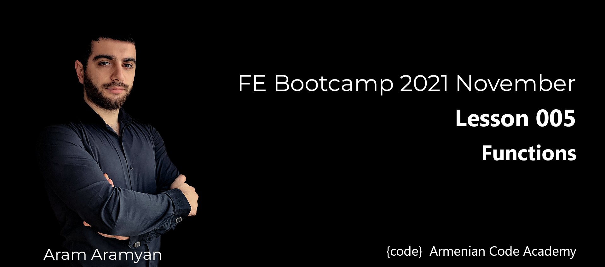

---

***1 Given an array of numbers. Write a function to separate odd and even numbers in different arrays.***\
[1_sepOddEven.js](1_sepOddEven.js)
___

***2 Write a function that calculates sum, difference, multiplication and division between given array
elements depending on passed operation symbol. Write appropriate function for each operation.***\
[2_calculate.js](2_calculate.js)
___

***3 Given a phone number. Write a function to clean it up, so it is valid. The rules are as follows:***\
- ***If the phone number is less than 10 digits assume that it is a bad number.***
- ***If the phone number is longer than 10, then it is a bad number.***
- ***If the phone number is 10 digits assume that it is good.***
- ***If the phone number consists of 11 symbols and the first one is + and others are numbers, then trim +
and return remaining 10 digits.***
- ***If the phone number contains + symbol more than one, consider it as a bad number.***
- ***If the phone number contains + symbol not as the first character, consider it as a badnumber.***\
***Ignore spaces between digits.***\
[3_phoneNumber.js](3_phoneNumber.js)
___
***4 Given a word and a list of possible anagrams, select the correct sublist.***\
[4_correctSublist.js](4_correctSublist.js)
___
***5 Write a function, which receives a string, finds possible largest numbers in the string and returns their
sum.***\
[5_getPossibleNumSum.js](5_getPossibleNumSum.js)
___

***6 Write a function which receives two strings and removes appearances of the second string from the
first one.***\
[6_delFromText.js](6_delFromText.js)
___

***7 Write a function to compute a new string from the given one by moving the first char to come after
the next two chars, so "abc" yields "bca". Repeat this process for each subsequent group of 3 chars.
Ignore any group of fewer than 3 chars at the end.***\
[7_computeNewStr.js](7_computeNewStr.js)
___

***8 Write a function that accepts a string(a sentence) as a parameter and finds the longest word within
the string. If there are several words which are the longest ones, print the last word(words can be
separated by space, comma or hyphen).***\
[8_getLongestWord.js](8_getLongestWord.js)
___

***9 Write a function which receives an array and a number as arguments and returns a new array from
the elements of the given array which are larger than the given number.***\
[9_getLargerNumbers.js](9_getLargerNumbers.js)
___

***10 Write a function to find longest substring in a given a string without repeating characters except
space character. If there are several, return the last one. Consider that all letters are lowercase.***\
[10_getLongestSubstr.js](10_getLongestSubstr.js)
___

***11 Write a function, which receives two numbers as arguments and finds all numbers between them such that each digit of the number is even. The numbers obtained should be printed in a comma-
separated sequence on a single line.***\
[11_getEvenDigitNums.js](11_getEvenDigitNums.js)
___

***13 Write a JavaScript function to get all possible subsets of length 3 of the given array. Assume that all
elements in the array are unique.***\
[13_possibleSubsets.js](13_possibleSubsets.js)
___

***14 Write a function, which receives an array as an argument which elements arrays of numbers. Find
product of biggest negative number of each array. If there is not any negative number, ignore that
array. Check that items of the given array are arrays.***\
[14_prodBigNegNums.js](14_prodBigNegNums.js)
___

